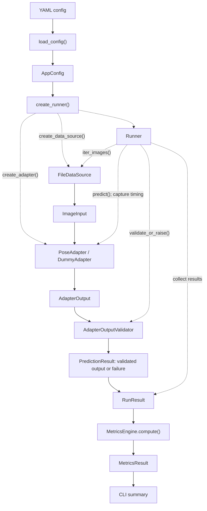
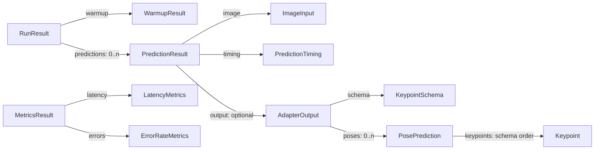

# Architecture

PoseDeployGate currently runs a config-driven, sequential pipeline: discover
files, predict poses, validate outputs, then calculate latency and reliability
metrics. `DummyAdapter` is the only registered adapter. Gate evaluation,
reference comparison, and report writing are not implemented; `gates.enabled`
and `output.dir` are config fields displayed by the CLI.

## Information flow

Solid arrows show data flow; dotted arrows show construction or orchestration.
The data-source implementation is `FileDataSource`; there is no separate
`DataSource` base class.

## Data structures

Arrows label fields that reference other structures. Core result and output
structures are frozen dataclasses; collection fields use tuples.

`ImageInput` holds an image ID and path. `PredictionTiming` holds an image ID
and elapsed nanoseconds. `PredictionResult.error` and `failure_kind` must both
be absent or both present. Runner failures have `output=None` and classify the
cause as `ADAPTER_EXECUTION` or `OUTPUT_VALIDATION`.

## Components

Source paths below are relative to `src/pose_deploy_gate/`.

| Component | Responsibility | Input | Output |
| --- | --- | --- | --- |
| `config/loader.py`: `load_config` | Validate path, parse YAML, validate Pydantic schema and application rules. | Config path | `AppConfig` |
| `runner/factory.py`: `create_runner` | Construct adapter, data source, and runner with configured policies. | `AppConfig` | `Runner` |
| `data/datasource.py`: `FileDataSource` | Discover matching files in deterministic relative-path order. | `DataConfig` | Iterator of `ImageInput` |
| `adapters/base.py`: `PoseAdapter` | Define `name` and `predict(image)`; implementation performs inference and normalization. | `ImageInput` | `AdapterOutput` |
| `validation/output.py`: `AdapterOutputValidator` | Check schema order, coordinates, visibility, confidence, and per-output person IDs. | `AdapterOutput` | Issue tuple or `AdapterOutputValidationError` |
| `runner/runner.py`: `Runner` | Run warmup, capture inference timing, validate and classify predictions. | Adapter, data source, timer, validator, policies | `RunResult` or `RunnerExecutionError` |
| `metrics/engine.py`: `MetricsEngine` | Derive latency statistics and prediction error rates. | `RunResult` | `MetricsResult` |
| `cli.py` | Wire configuration, execution, metrics, and terminal reporting. | CLI arguments | Summary or error; exit code |

## Execution flow

1. `python -m pose_deploy_gate --config ...` enters `cli.main()`;
   `load_config()` returns a validated `AppConfig`.
2. `create_runner()` uses `create_adapter()` and `create_data_source()`; Runner
   supplies default `Timer` and `AdapterOutputValidator` instances.
3. `Runner.run()` materializes `iter_images()` into an ordered tuple before
   starting the run timer. File discovery raises if no matching inputs exist.
4. Warmup repeatedly predicts the first image and validates every output. Any
   warmup execution or validation failure aborts; warmup produces no predictions.
5. For each image, Runner calls `predict()` and captures elapsed nanoseconds
   **before** validating the returned output.
6. Valid outputs become successful `PredictionResult` entries. Measured failures
   abort by default; `continue_on_error=True` records a classified failure with
   no output and proceeds to the next image.
7. Runner returns `RunResult` with warmup, predictions, and total timing.
   `MetricsEngine.compute()` uses only entries with `error is None` for latency,
   while all predictions count toward attempts and failures.
8. CLI prints metrics and counts by failure kind. Fail-fast errors include the
   image and validation details and return exit code `2`.

## Architectural boundaries

- **Configuration** parses and validates settings; it does not run inference.
- **Data source** discovers paths and assigns IDs; it does not decode images,
  run inference, or validate pose outputs.
- **Adapter** performs model-specific inference and normalization; it does not
  manage run policies, aggregate metrics, or print CLI summaries.
- **Runner** owns orchestration, timing, and failure policy; it does not perform
  model-specific normalization or compute deployment metrics. Its result
  properties provide basic counts and timing aggregates.
- **Validation** checks contract compliance and aggregates issues; it does not
  repair or normalize outputs. It runs outside measured prediction latency.
- **MetricsEngine** derives metrics from `RunResult`; it does not run inference,
  rediscover inputs, or revalidate adapter outputs.
- **CLI** presents results and errors; it does not implement inference or
  normalization rules.

For details, see the [output contract](output-contract.md),
[configuration](config.md), [runner](runner.md), and [metrics](metrics.md).
